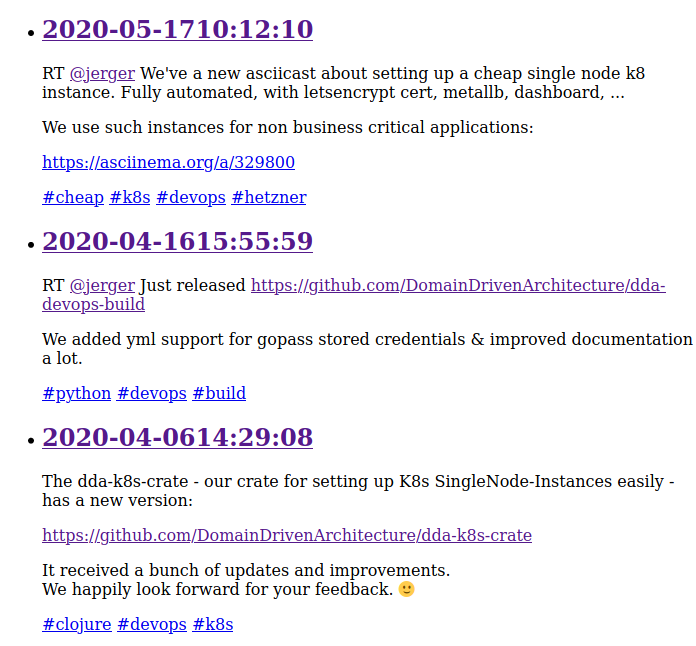

# dda-masto-embed


[ team@social.meissa-gmbh.de](https://social.meissa-gmbh.de/@team) | [Website & Blog](https://domaindrivenarchitecture.org)

## in brief

dda-masto-embed embedd either your timeline or answers to an specific post on your website.
* Uses JS, **no intermediate server** required,
* in answer mode you can deside to show only favorited answers in order to do upfront moderation
* example for embedding a timeline at [meissa-gmbh.de/news](https://meissa-gmbh.de/pages/news/)
* example for embedding answers to a specific post at [meissa-gmbh.de/sustainibility_microplastic](https://meissa-gmbh.de/pages/about_meissa/gemeinwohl/sustainability_microplastic/)
* Download latest version at:
  * [dda-masto-embed.js](https://domaindrivenarchitecture.org/downloads/dda-masto-embed.js)
  * [dda-masto-embed.js.sha256](https://domaindrivenarchitecture.org/downloads/dda-masto-embed.js.sha256)
  * [dda-masto-embed.js.sha512](https://domaindrivenarchitecture.org/downloads/dda-masto-embed.js.sha512)
* It is **OpenSource** - published under the Apache License, Version 2.0

## how it looks


## include a timeline

Including a timeline needs the following html. The div with id `masto-embed` configures the timeline to be showed.
We use bootstrap for a rough styling. More styling is up to you at the moment, help is welcome :-)

```
<!doctype html>
<html>
  <head>
    <meta charset="utf-8" />
    <title>masto-embed</title>
    <link rel="stylesheet" href="https://stackpath.bootstrapcdn.com/bootstrap/4.5.0/css/bootstrap.min.css" 
          integrity="sha384-9aIt2nRpC12Uk9gS9baDl411NQApFmC26EwAOH8WgZl5MYYxFfc+NcPb1dKGj7Sk" 
          crossorigin="anonymous">
  </head>
  <body>
    <div id="masto-embed" 
          account_name="team"
          host_url="https://social.meissa-gmbh.de">
      Here the timeline will appear.
    </div>
    <script src="https://domaindrivenarchitecture.org/downloads/dda-masto-embed.js"></script>
  </body>
</html>
```

Reference:
* `id` has to be `masto-embed`
* `account_name` is the name of your account. If you know your numeric `account_id` you can use your id instead for a performance increase.
* `host_url` the url of your mastodon instance.


## using in reply mode

Including replies of one of your posts will work as follows:

```
<!doctype html>
<html>
  <head>
    <meta charset="utf-8" />
    <title>masto-embed</title>
    <link rel="stylesheet" href="https://stackpath.bootstrapcdn.com/bootstrap/4.5.0/css/bootstrap.min.css" 
          integrity="sha384-9aIt2nRpC12Uk9gS9baDl411NQApFmC26EwAOH8WgZl5MYYxFfc+NcPb1dKGj7Sk" 
          crossorigin="anonymous">
  </head>
  <body>
    <div id="masto-embed" 
          account_name="team"
          replies_to="107937234506182462"
          filter_favorited=false
          host_url="https://social.meissa-gmbh.de">
      Here the timeline will appear.
    </div>
    <script src="https://domaindrivenarchitecture.org/downloads/dda-masto-embed.js"></script>
  </body>
</html>
```
Reference:
* `id` has to be `masto-embed`
* `account_name` is the name of your account. If you know your numeric `account_id` you can use your id instead for a performance increase.
* `host_url` the url of your mastodon instance.
* `replies_to` the id of your post.
* `filter_favorited=<true|false>` true will show only favorited replies, false will show every answer.


## dev setup

```
npm install -g npx
npm install -g shadow-cljs
npm install -g source-map-support --save-dev
npm install
shadow-cljs watch frontend
```

open browser at http://localhost:8080

Connect your repl for :frontend


## run the tests

```
shadow-cljs compile test
```

## releasing
### prod release
```
#adjust version
vi package.json
git commit -am 'releasing'
git tag -am 'releasing' <version>
git push --follow-tags

# Bump version
vi package.json
git commit -am "version bump" && git push
```

## License

Copyright © 2021 meissa GmbH
Licensed under the [Apache License, Version 2.0](LICENSE) (the "License")
Pls. find licenses of our subcomponents [here](doc/SUBCOMPONENT_LICENSE)